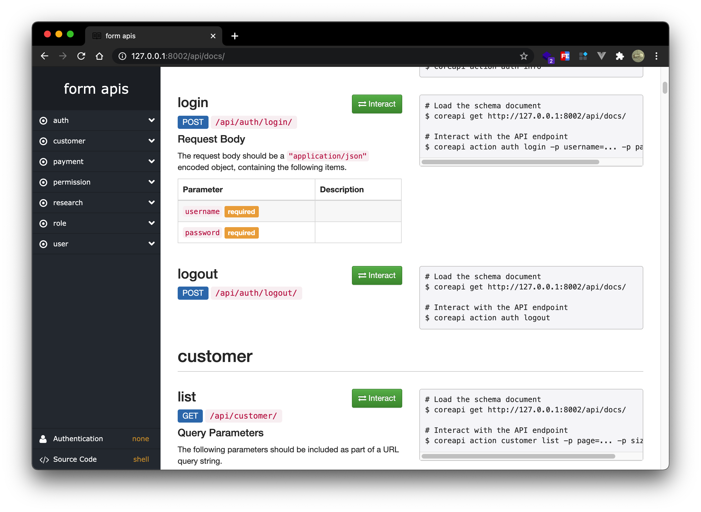

# research_sys

## About The Project

> Dynamic form, survey questionnaire backend system. Front-end repo: [vue-research-admin](https://github.com/Pandalzy/vue-research-admin)

### Api docs



### Built With

- [Django](https://docs.djangoproject.com/en/3.1/)

## Related Project

- [vue-research-admin](https://github.com/Pandalzy/vue-research-admin)

## Getting Started

### Installation

1. clone the project

```sh
git clone https://github.com/Pandalzy/research_sys.git
```

2. enter the project directory

```sh
cd research_sys
```

3. install dependency

```sh
pip install -r requirements.txt
```

### Configuration

Edit `research_sys/setting.py` file and modify as your own database.

```python
MONGODB_DATABASES = {
    "default": {
        "name": 'test',
        "host": '127.0.0.1',
        "username": 'admin',
        "password": '123456',
        "authentication_source": 'admin',
        "tz_aware": False,  # if you using timezones in django (USE_TZ = True)
    },
}

INSTALLED_APPS += ["django_mongoengine"]
```

### Run

```sh
python manage.py runserver
```

## License

Distributed under the MIT License. See `LICENSE` for more information.

## Acknowledgements

- [django-rest-framework](https://www.django-rest-framework.org/)
- [django-rest-framework-mongoengine](http://umutbozkurt.github.io/django-rest-framework-mongoengine/)
- [django-mongoengine](https://github.com/MongoEngine/django-mongoengine)
- [django-rest-framework-simplejwt](https://django-rest-framework-simplejwt.readthedocs.io/en/latest/)

